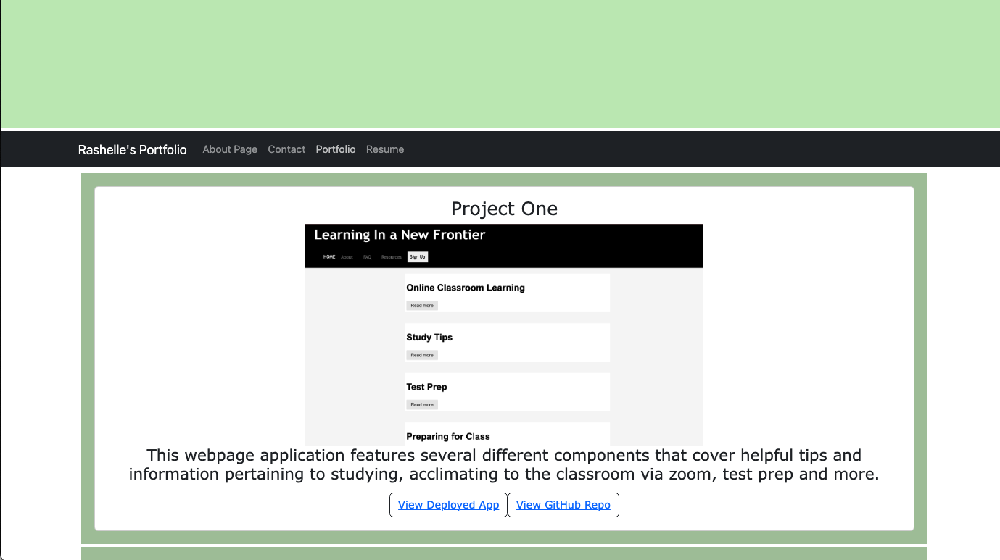

# Portfolio Site using React + JavaScript
  
  ## Description
  This repository contains information about my first portfolio website. Here you can find important information about the back-end of the application, and how to replicate the process! 
  Please refer to the end of the document for information about how to contact the developer - me! 
  ## Table of Contents
  - [Installation](#installation)
  - [Usage](#usage)
  - [License](#license)
  - [Contributors](#contributors)
  - [Tests](#tests)
  - [Questions](#questions)
  ## Installation
  - npm i to install dependency packages
  - npm start to run application 
  ## Screenshot 
  
  ## Dependencies 
  - VS Code
  - react-router-dom
  - React @latest
  - React-bootstrap @latest
  - Bootstrap, Bootstrap icons @latest
  - esLint
  - Vite @latest
  ## Tests 
  npm run dev
  ## License 
  MIT
  ## Questions
  Please send any questions or comments [to](mailto:shelleb93@gmail.com) or [github/brownfielde](https://github.com/brownfielde)
